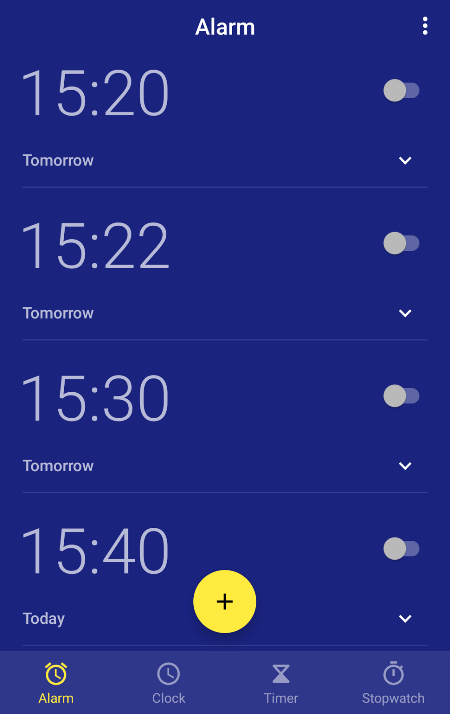

# O aplikacji
Ta aplikacja służy do tworzenia jednorazowych alarmów, które nie powtarzają się w czasie, np. alarm że o 15:30 jest pociąg.
Wykorzystując do tego celu zwykłą aplikacje do alarmów, musiałem każdy taki alarm usuwać ręcznie aby utrzymać porządek.
Wykorzystując kalendarz przypomnienia były zbyt ciche więc mogłem ich nie zauważyć, jeśli nie miałem telefonu przed sobą.
Ta aplikacja rozwiązuje ten problem. Kiedy alarm jest uruchomiony, nie musi być ręcznie usuwany, usuwa się automatycznie.

PROSZĘ PRZECZYTAĆ PRZED UŻYCIEM!
W tej aplikacji możliwe jest tylko ustawienie alarmu na dzisiaj lub jutro!
Proszę nie oczekiwać że ta aplikacja zastąpi domyślną aplikacje alarmu lub kalendarza!
To po prostu inny rodzaj aplikacji, służy tylko do ustawiania jednorazowych alarmów!

# Zdjęcia
### Ekrań alarmów

### Ustawianie czasu

### Dodawanie alarmu

### Edytowanie alarmu

### Ekran ustawień

### Wyłączanie alarmu

# Bonus
Taki miałem bałagan w zwykłej aplikacji od alarmów ;)

