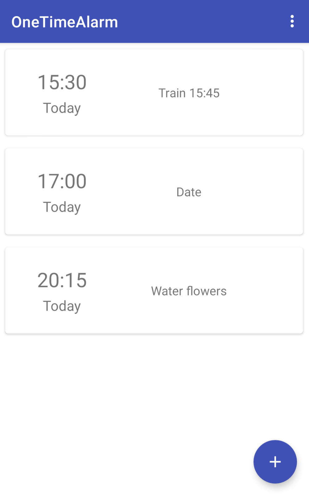
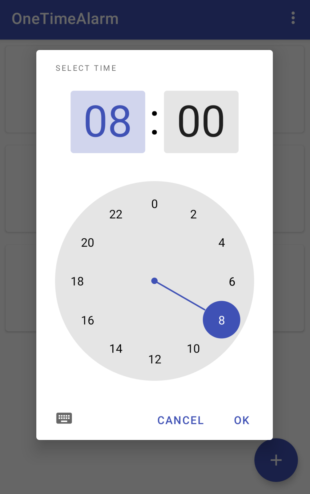
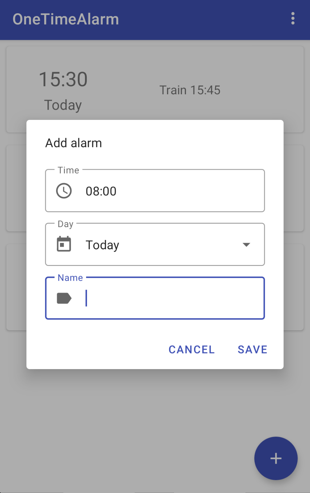
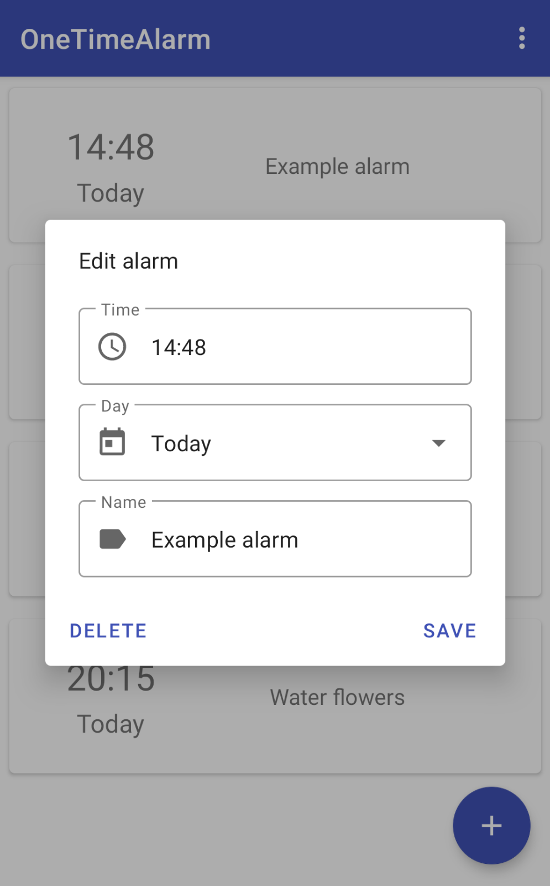
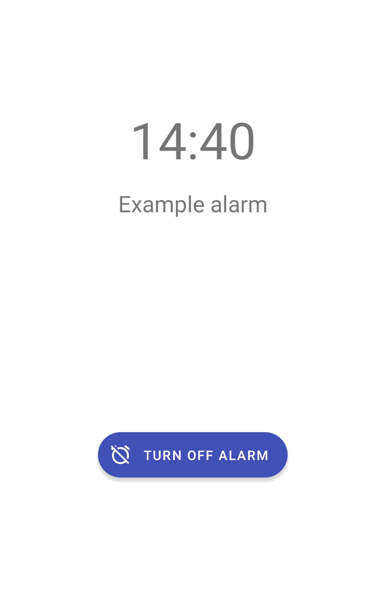
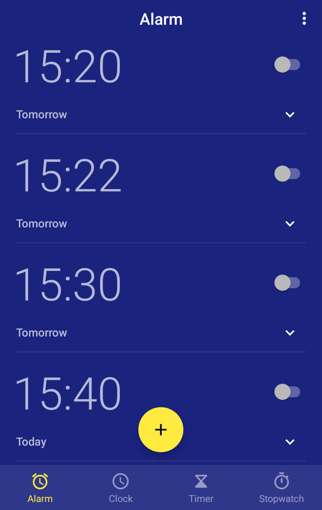

# About
The use case for this app is creating reminders which are only relevant once in a time and they don't repeat such as reminders to go to the train on 15:30.
Using standard alarm app I had a lot of alarms which then I had to delete manually to avoid clutter.
Using the standard calendar event notifications were not loud enough so I could forget about them if I didn't have my phone nearby.
This app solves this use case. After alarm is fired it is deleted, it doesn't have to be deleted manually as in normal alarm application.

READ BEFORE USE!
In this app it's only possible to set alarms which don't repeat and only for today or tomorrow!
Don't expect this app to be used as a replacement for your standard alarm app or calendar! 
It's a diferent type of application! It is not a calendar or standard alarm clock app.

# Screenshots
### Alarm view

### Setting the time

### Adding alarm

### Editing alarm

### Settings view

### Turning off alarm

# Bonus
This what I mean by clutter in the standard alarm app. I had over hundred alarms ;)

